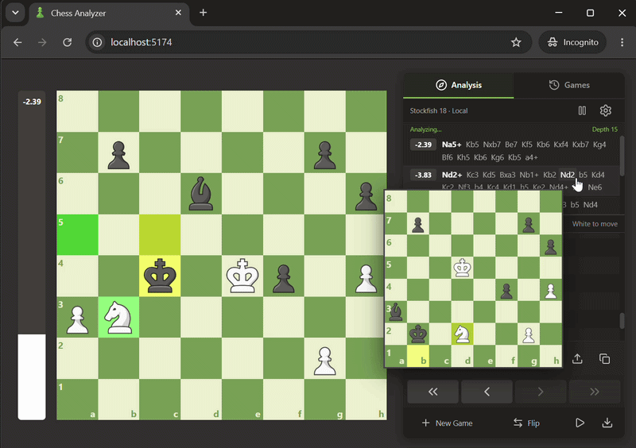

# Chess Analyzer



A React + TypeScript + SCSS chess analyzer with the original board-first layout. The green-and-cream squares and local Chess.com-style piece images are preserved. Local Stockfish 18 is the only engine.

Live demo: https://chess-analyzer-white.vercel.app/

## Run

Requires Node.js 24 or newer.

```sh
npm install
npm run dev
```

Open `http://localhost:5173`. The development server also accepts local network connections for testing on a phone.

```sh
npm run build
npm run preview
```

Deploy `dist` to a static host. Install, development, and build hooks copy the pinned `stockfish@18.0.8` single-threaded Lite worker, WASM binary, and license into `public/engine`. No backend or cross-origin isolation headers are required.

## Original workflow

- Large board on the left, Analysis/Games sidebar on the right. Mobile places the board first, with accessible analysis and game controls underneath.
- Original piece images from `public/pieces`, green `#779954` squares, and cream `#e9edcc` squares on the main board and previews.
- Hover an engine move, history move, variation, or saved game to preview its position. Click or tap a move to jump directly there.
- FEN/PGN import opens in a popup from the FEN row. Copy FEN and export the active game as PGN.
- Depth and principal-variation count live in the settings popup. There is no remote provider, engine selector, or thinking-time setting.
- Stockfish starts immediately and searches with `go depth`. Results stream as they arrive. Cancellation terminates obsolete workers; there is no deliberate thinking delay or move-time budget.
- Completed local results are cached by position and settings. Nearby history is analyzed sequentially after the visible position is complete. The evaluation bar retains its last score until another evaluation is available.
- Games, the active cursor, and alternative continuations save automatically. Reload returns to the last active position. Inactive games can be deleted from the Games tab.
- Following an existing move preserves the remaining continuation. Branching preserves the old line as an alternative; the Variations control switches between saved paths.
- Existing records from the original `chess_games` storage and the previous saved-game format are migrated on first use.
- Arrow keys navigate moves, Up/Down jump to the start/end, F flips the board, and Space plays the current engine best move. Shortcuts do not intercept text input or modal dialogs.
- Control-click highlights a square, Control-drag draws an arrow, and right-click clears markup. Touch moves, dragging, all four promotion choices, and game-over detection remain available.

## Checks

```sh
npm run lint
npm test
npm run build
npx playwright install chromium
npm run test:e2e
```

Lint enforces comments at the top of project-owned code files and above every implemented function. Code, comments, and interface text are in English. All authored styles use SCSS.

Browser tests exercise the actual npm Stockfish WASM engine at desktop and phone viewport sizes, popup import/settings, direct move navigation, hover previews, autosave, alternative lines, evaluation continuity, piece assets, square colors, promotion, and export.

## Main files

- `src/App.tsx`: original analysis/game layout and game lifecycle.
- `src/components/Board.tsx`: original pieces, touch/drag moves, promotion, and board markup.
- `src/components/MoveButton.tsx`: floating hover previews and immediate navigation.
- `src/components/EvaluationBar.tsx`: retained evaluation and smooth transitions.
- `src/components/Modal.tsx`: native focus-trapped popup dialogs.
- `src/engines.ts`: local UCI worker with depth-based searches.
- `src/useAnalysis.ts`: immediate analysis, cancellation, local cache, and nearby history evaluation.
- `src/storage.ts`: autosave, validation, and migration of older games.
- `src/styles.scss`: original layout and responsive styles.

## Licenses

Application code uses the [MIT license](LICENSE). Stockfish.js is a separate GPL-3.0 dependency by Nathan Rugg / Chess.com and the Stockfish contributors. Its worker, WASM binary, and `Copying.txt` are copied unchanged from the pinned npm package. See [Stockfish.js source](https://github.com/nmrugg/stockfish.js) and [the exact npm package](https://www.npmjs.com/package/stockfish/v/18.0.8). Preserve the engine license and comply with its source-distribution requirements when redistributing it. License and source links are also available in the engine settings popup.
